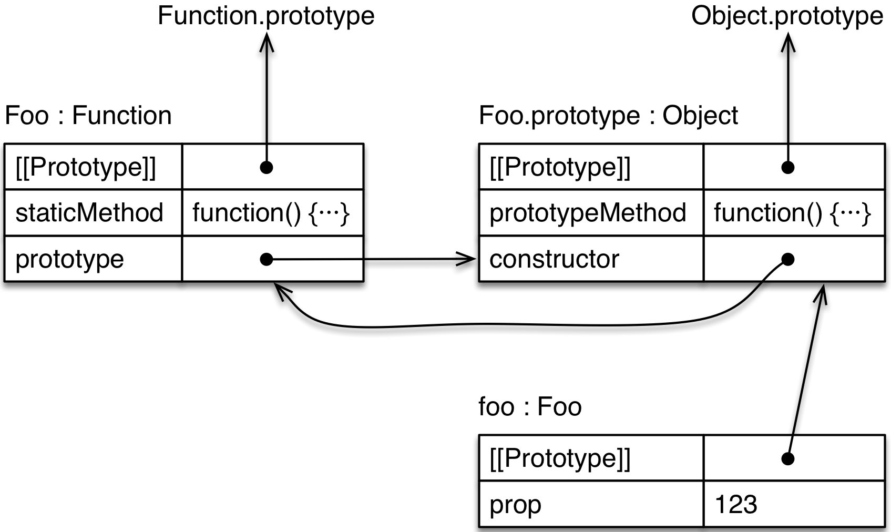
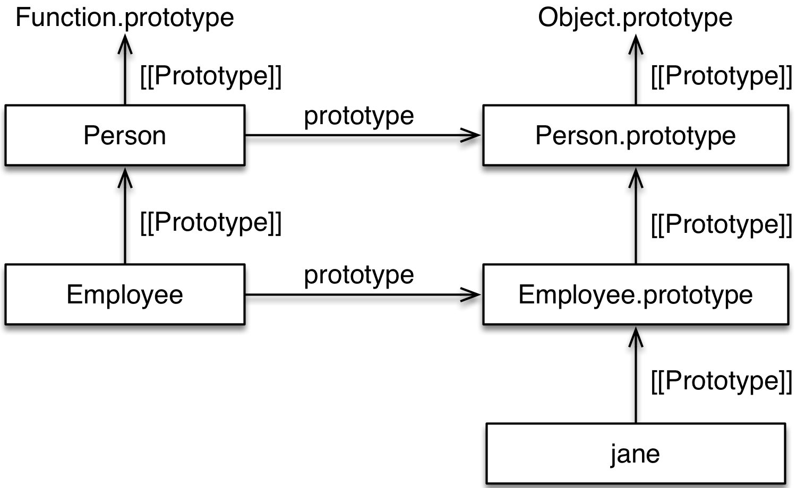
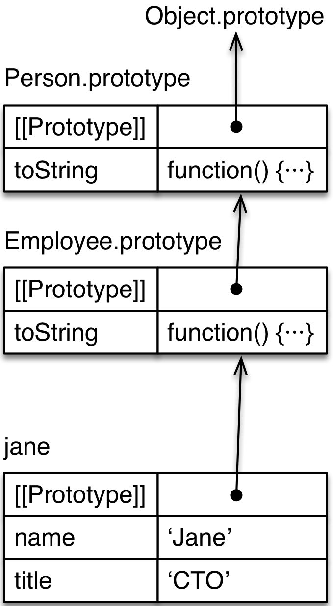

# 15. 클래스

이 장은 ES6 클래스가 작동하는 방법에 대해 설명합니다.

## 15.1 개요

클래스와 서브 클래스

```javascript
class Point {
    constructor(x, y) {
        this.x = x;
        this.y = y;
    }
    toString() {
        return `(${this.x}, ${this.y})`;
    }
}

class ColorPoint extends Point {
    constructor(x, y, color) {
        super(x, y);
        this.color = color;
    }
    toString() {
        return super.toString() + ' in ' + this.color;
    }
}
```

클래스 사용:

```javascript
> const cp = new ColorPoint(25, 8, 'green');

> cp.toString();
'(25, 8) in green'

> cp instanceof ColorPoint
true
> cp instanceof Point
true
```

ES6의 클래스는 근본적으로 새로운 것은 아닙니다.: 주로 이전 버전에서의 생성자 함수를 만들 수 있는 편리한 구문을 제공하는 것입니다. typeof를 사용하여 확인 가능합니다:

```javascript
> typeof Point
'function'
```

## 15.2 필수"

### 15.2.1 기본 클래스

ECMAScript 6에서 클래스는 다음과 같이 정의합니다:

```javascript
class Point {
    constructor(x, y) {
        this.x = x;
        this.y = y;
    }
    toString() {
        return `(${this.x}, ${this.y})`;
    }
}
```

이것을 ES5의 생성자 함수처럼 사용합니다 :

```javascript
> var p = new Point(25, 8);
> p.toString()
'(25, 8)'
```

사실, 클래스 정의의 결과는 함수입니다 :

```javascript
> typeof Point
'function'
```

하지만 함수 호출이 아닌 new를 통해서만 호출할 수 있습니다, ( 이론적인 근거는 뒤에 설명합니다. ) :

```javascript
> Point()
TypeError: Classes can’t be function-called
```

> 스펙에 따르면, 클래스를 함수처럼 호출하는 것은 함수 객체의 내부 메소드인 [[Call]]에서 저지됩니다.

#### 15.2.1.1 클래스 선언은 호이스팅되지 않습니다

함수 선언은 호이스팅됩니다: 스코프 내에서 선언된 함수는 선언이 일어난 위치에 상관없이 즉시 사용이 가능합니다. 나중에 선언된 함수를 호출 할 수 있다는 의미입니다.

```javascript
foo(); // 'foo'는 호이스팅되기 때문에 정상 동작합니다.

function foo() {}
```

반면, 클래스 선언은 호이스팅되지 않습니다. 따라서, 클래스는 execution이 클래스 선언에 도달하고 평가된 이후에만 존재합니다. 그전에 접근하면 ReferenceError가 발생합니다. :

```javascript
new Foo(); // ReferenceError

class Foo {}
```

이런 제약의 이유는 클래스가 extends라는 적절한 위치에서 평가되어야만 하는 표현을 가지기 때문입니다. 이 평가는 호이스팅 될 수 없습니다.

호이스팅되지 않는 것은 생각보다 작은 제약입니다. 예를 들어, 클래스 선언 이전에 존재하는 함수는 여전히 클래스를 참조할 수 있습니다. 다만, 클래스 선언이 평가되기까지 기다렸다가 호출해야 합니다.

```javascript
function functionThatUsesBar() {
    new Bar();
}

functionThatUsesBar(); // ReferenceError
class Bar {}
functionThatUsesBar(); // OK
```

#### 15.2.1.2 클래스 표현식

함수처럼 선언식과 표현식, 두 가지의 클래스 정의 방식이 있습니다.

함수 표현식과 마찬가지로, 클래스 선언식은 익명으로 할 수 있습니다:

```javascript
const MyClass = class {
    ···
};
const inst = new MyClass();
```

또한 유사하게 표현 기능, 클래스 표현은 그들 내부에서만 볼 수 있습니다 이름을 가질 수 있습니다 :

또한 함수 표현식과 유사하게, 클래스 표현식은 내부에서만 참조 가능한 이름을 가질 수 있습니다.:

```javascript
const MyClass = class Me {
    getClassName() {
        return Me.name;
    }
};
const inst = new MyClass();

console.log(inst.getClassName()); // Me
console.log(Me.name); // ReferenceError: Me is not defined
```

예제의 마지막 두 라인에서 Me는 클래스의 외부 변수가 되지 않았지만 내부에서 사용될 수 있음을 보여줍니다.

### 15.2.2 클래스 정의의 몸체

클래스 본문은 데이터 속성은 포함할 수 없고 단지 메소드만 포함할 수 있습니다. 프로토 타입에 데이터 속성을 갖는 것은 일반적으로 안티 패턴이라 여겨지므로 클래스 본문이 메서드만 포함할 수 있는 것은 바른 사용을 강제합니다.


#### 15.2.2.1 생성자, 정적 메소드, 프로토 타입 메소드

이제 클래스 정의에서 자주 발견하게 될 3가지 종류의 메서드를 살펴보겠습니다.

```javascript
class Foo {
    constructor(prop) {
        this.prop = prop;
    }
    static staticMethod() {
        return 'classy';
    }
    prototypeMethod() {
        return 'prototypical';
    }
}
const foo = new Foo(123);
```

이 클래스 정의의 객체 다이어그램은 아래와 같다. 이해하기 위한 팁 : 프로토 타입 값이 목적은 일반 속성이있는 동안 [[Prototype]]은 객체 사이의 상속 관계다. 프로토타입은 객체를 값으로 가지고 있는 보통의 속성이다. 프로토타입 속성은 new 연산자가 생성할 인스턴스의 프로토타입으로 사용하기 때문에 특별하다.



첫째, 의사 메소드 생성자입니다. 이 메소드는 클래스를 대표하는 함수를 정의하기 때문에 특별합니다 :

```javascript
> Foo === Foo.prototype.constructor
true
> typeof Foo
'function'
```

194

클래스 생성자로 불리기도 합니다. 일반 생성자 함수에게는 없는 기능을 가지고 있습니다. ( 생성자 호출에서 super()를 통해 superconstructor 에 접근가능한 것으로 뒤에 설명합니다. )

둘째, 정적 방법. 정적 특성 (또는 클래스 속성은) Foo 자체의 속성입니다. 정적와 메소드 정의 앞에 경우에, 당신은 클래스 메소드를 만듭니다

두번째로, 정적 메소드입니다. 정적 속성 ( 또는 클래스 속성 )은 Foo 자신의 속성입니다. 메서드 정의를 static과 함께 prefix할 경우 클래스 메소드를 만들 수 있습니다.:

```javascript
> typeof Foo.staticMethod
'function'
> Foo.staticMethod()
'classy'
```

셋째, 프로토 방법. Foo의 프로토 타입 속성 Foo.prototype의 재산입니다. 그들은 일반적으로 방법과 Foo의 인스턴스에 의해 상속됩니다. `Third, prototype methods. The prototype properties of Foo are the properties of Foo.prototype. They are usually methods and inherited by instances of Foo.`

```javascript
> typeof Foo.prototype.prototypeMethod
'function'
> foo.prototypeMethod()
'prototypical'
```

#### 15.2.2.2 정적 데이터 등록 `Static data properties`

지금은 클래스는 당신이 정적 메서드가 아닌 정적 데이터 속성을 만들 수 있습니다. 그에 대한 해결 방법에는 두 가지가 있습니다. `For now, classes only let you create static methods, but not static data properties. There are two work-arounds for that.`

첫째, 당신은 수동으로 정적 속성을 추가 할 수 있습니다 : `First, you can manually add a static property:`

```javascript
class Point {
    constructor(x, y) {
        this.x = x;
        this.y = y;
    }
}
Point.ZERO = new Point(0, 0);
```

둘째, 정적 게터를 만들 수 있습니다 : `Second, you can create a static getter:`

```javascript
class Point {
    constructor(x, y) {
        this.x = x;
        this.y = y;
    }
    static get ZERO() {
        return new Point(0, 0);
    }
}
```

두 경우 모두, 당신은 당신이 읽을 수있는 속성 Point.ZERO을 찾으실 수 있습니다. 전자의 경우, 당신은 읽기 전용 속성을 만들 Object.defineProperty ()를 사용할 수 있습니다,하지만 난 과제의 단순함을 좋아한다. `In both cases, you get a property Point.ZERO that you can read. In the former case, you could use Object.defineProperty() to create a read-only property, but I like the simplicity of an assignment.`

#### 15.2.2.3 게터와 세터 `Getters and setters`

getter와 setter의 구문은 단지 인 ECMAScript 5 객체 리터럴에서 같다 : `The syntax for getters and setters is just like in ECMAScript 5 object literals:`

```javascript
class MyClass {
    get prop() {
        return 'getter';
    }
    set prop(value) {
        console.log('setter: '+value);
    }
}
```

다음과 같이 MyClass를 사용합니다. `You use MyClass as follows.`

```javascript
> const inst = new MyClass();
> inst.prop = 123;
setter: 123
> inst.prop
'getter'
```

#### 15.2.2.4 계산 메소드 이름 `Computed method names`

당신이 괄호에 넣어 경우, 식을 통해 메소드의 이름을 정의 할 수 있습니다. 예를 들어, Foo를 정의하는 다음과 같은 방법으로 모두 동일합니다. `You can define the name of a method via an expression, if you put it in square brackets. For example, the following ways of defining Foo are all equivalent.`

```javascript
class Foo() {
    myMethod() {}
}

class Foo() {
    ['my'+'Method']() {}
}

const m = 'myMethod';
class Foo() {
    [m]() {}
}
```

ECMAScript를 6에서 몇 가지 특별한 방법이 상징 키를 가지고있다. 계산 방법 이름은 당신이 그런 방법을 정의 할 수 있습니다. 객체가 그 키 Symbol.iterator 인 방법을 가지고 예를 들어, 그것은 반복 가능하다. 즉, 그 내용은 for에 대한 루프 및 기타 언어 메커니즘에 의해 이상 반복 할 수 있다는 것을 의미한다. `Several special methods in ECMAScript 6 have keys that are symbols. Computed method names allow you to define such methods. For example, if an object has a method whose key is Symbol.iterator, it is iterable. That means that its contents can be iterated over by the for-of loop and other language mechanisms.`

```javascript
class IterableClass {
    [Symbol.iterator]() {
        ···
    }
}
```

#### 15.2.2.5 제너레이터 메소드 `Generator methods`

별표 (\*)에있어서 정의 접두사 경우 발생 방법이된다. 무엇보다도, 제너레이터는 그 키 Symbol.iterator있는 방법을 정의하는 데 유용합니다. 그 작동 방법 다음 코드는 보여줍니다. `If you prefix a method definition with an asterisk (*), it becomes a generator method. Among other things, a generator is useful for defining the method whose key is Symbol.iterator. The following code demonstrates how that works.`

```javascript
class IterableArguments {
    constructor(...args) {
        this.args = args;
    }
    * [Symbol.iterator]() {
        for (const arg of this.args) {
            yield arg;
        }
    }
}

for (const x of new IterableArguments('hello', 'world')) {
    console.log(x);
}

// Output:
// hello
// world
```

### 15.2.3 서브클래싱 `Subclassing`

절은 당신이 (또는 클래스를 통해 정의되지 않았을 수도 있습니다) 기존의 생성자의 서브 클래스를 만들 수 확장 : `The extends clause lets you create a subclass of an existing constructor (which may or may not have been defined via a class):`

```javascript
class Point {
    constructor(x, y) {
        this.x = x;
        this.y = y;
    }
    toString() {
        return `(${this.x}, ${this.y})`;
    }
}

class ColorPoint extends Point {
    constructor(x, y, color) {
        super(x, y); // (A)
        this.color = color;
    }
    toString() {
        return super.toString() + ' in ' + this.color; // (B)
    }
}
```

당신이 기대하는 것처럼 또 다시,이 클래스가 사용됩니다 : `Again, this class is used like you’d expect:`

```javascript
> const cp = new ColorPoint(25, 8, 'green');
> cp.toString()
'(25, 8) in green'

> cp instanceof ColorPoint
true
> cp instanceof Point
true
```

클래스의 두 가지 종류가 있습니다 : `There are two kinds of classes:`

- 이 절을 확장하지 않기 때문에 Point, 기본 클래스입니다. `Point is a base class, because it doesn’t have an extends clause.`
- ColorPoint는 파생 클래스입니다. `ColorPoint is a derived class.`

super를 사용하는 두 가지 방법이 있습니다 : `There are two ways of using super:`

- 클래스 생성자 (클래스 정의에 유사 방법 생성자) 함수 호출처럼 사용 (super (···)), 슈퍼 생성자 호출 (라인 A)를 확인하기 위해. `A class constructor (the pseudo-method constructor in a class definition) uses it like a function call (super(···)), in order to make a superconstructor call (line A).`
- (또는 정적없이 객체 리터럴 또는 클래스에서) 메소드의 정의는 super 특성 (라인 B)를 참조하기 위해, 속성 참조 (super.prop) 또는 메서드 호출 (super.method (···))처럼 사용합니다. `Method definitions (in object literals or classes, with or without static) use it like property references (super.prop) or method calls (super.method(···)), in order to refer to superproperties (line B).`

#### 15.2.3.1 서브 클래스의 프로토 타입은 슈퍼 클래스입니다 `The prototype of a subclass is the superclass`

서브 클래스의 프로토 타입은 ECMAScript를 6 슈퍼 클래스입니다 : `The prototype of a subclass is the superclass in ECMAScript 6:`

```javascript
> Object.getPrototypeOf(ColorPoint) === Point
true
```

즉, 정적 속성이 상속된다는 것을 의미한다 : `That means that static properties are inherited:`

```javascript
class Foo {
    static classMethod() {
        return 'hello';
    }
}

class Bar extends Foo {
}
Bar.classMethod(); // 'hello'
```

정적 메소드를 super 호출 할 수 있습니다 : `You can even super-call static methods:`

```javascript
class Foo {
    static classMethod() {
        return 'hello';
    }
}

class Bar extends Foo {
    static classMethod() {
        return super.classMethod() + ', too';
    }
}
Bar.classMethod(); // 'hello, too'
```

#### 15.2.3.2 슈퍼 생성자 호출 `Superconstructor calls`

사용하기 전에 파생 클래스에서는 super ()를 호출해야합니다 : `In a derived class, you must call super() before you can use this:`

```javascript
class Foo {}

class Bar extends Foo {
    constructor(num) {
        const tmp = num * 2; // OK
        this.num = num; // ReferenceError
        super();
        this.num = num; // OK
    }
}
```

암시 적 super()는 에러가 발생를 호출하지 않고 파생 생성자를 떠나 : `Implicitly leaving a derived constructor without calling super() also causes an error:`

```javascript
class Foo {}

class Bar extends Foo {
    constructor() {
    }
}

const bar = new Bar(); // ReferenceError
```

#### 15.2.3.3 생성자의 결과를 재정의 `Overriding the result of a constructor`

그냥 ES5처럼, 당신은 명시 적으로 객체를 반환하여 생성자의 결과를 재정의 할 수 있습니다 : `Just like in ES5, you can override the result of a constructor by explicitly returning an object:`

```javascript
class Foo {
    constructor() {
        return Object.create(null);
    }
}
console.log(new Foo() instanceof Foo); // false
```

이렇게하면,이 초기화되었는지 아닌지 상관 없다. 즉 : 이 방식으로 결과를 무시할 경우 파생 생성자 () super를 호출 할 필요가 없습니다. `If you do so, it doesn’t matter whether this has been initialized or not. In other words: you don’t have to call super() in a derived constructor if you override the result in this manner.`

#### 15.2.3.4 클래스의 기본 생성자 `Default constructors for classes`

기본 클래스의 생성자를 지정하지 않을 경우, 다음과 같은 정의가 사용된다 : `If you don’t specify a constructor for a base class, the following definition is used:`

```javascript
constructor() {}
```

파생 클래스의 경우, 다음과 같은 기본 생성자가 사용된다 : `For derived classes, the following default constructor is used:`

```javascript
constructor(...args) {
    super(...args);
}
```

#### 15.2.3.5 기본 생성자를 서브 클래싱 `Subclassing built-in constructors`

ECMAScript를 6에서, 마지막으로 모든 내장 생성자 (가 ES5에 대한 해결 방법이 있지만,이 상당한 제한이 있습니다)를 서브 클래 싱 할 수 있습니다. `In ECMAScript 6, you can finally subclass all built-in constructors (there are work-arounds for ES5, but these have significant limitations).`

예를 들어, 지금 자신의 예외 클래스 (즉, 대부분의 엔진에 스택 트레이스를 갖는 기능을 상속합니다) 만들 수 있습니다 : `For example, you can now create your own exception classes (that will inherit the feature of having a stack trace in most engines):`

```javascript
class MyError extends Error {
}
throw new MyError('Something happened!');
```

또한 인스턴스 제대로 길이를 처리 할 배열의 하위 클래스를 만들 수 있습니다 : `You can also create subclasses of Array whose instances properly handle length:`

```javascript
class MyArray extends Array {
    constructor(len) {
        super(len);
    }
}

// Instances of of `MyArray` work like real Arrays:
const myArr = new MyArray(0);
console.log(myArr.length); // 0
myArr[0] = 'foo';
console.log(myArr.length); // 1
```

엔진이 기본적으로 지원해야 뭔가가 서브 클래스 기본 생성자를 참고, 당신은 transpilers를 통해이 기능을받지 않습니다. `Note that subclassing built-in constructors is something that engines have to support natively, you won’t get this feature via transpilers.`

## 15.3 클래스의 Private 데이터 `Private data for classes`

이 섹션에서는 ES6 클래스에 대한 private 정보를 관리하기위한 네 가지 방법을 설명합니다 : `This section explains four approaches for managing private data for ES6 classes:`

1. 클래스 생성자의 환경에서 private 정보를 유지 `Keeping private data in the environment of a class constructor`
2. 이름 지정 규칙 (예를 들어, 접두사 밑줄)를 통해 private 특성을 표시 `Marking private properties via a naming convention (e.g. a prefixed underscore)`
3. WeakMaps에 private 정보를 유지 `Keeping private data in WeakMaps`
4. private 속성에 대한 키로 기호를 사용하여 `Using symbols as keys for private properties`

접근 방법 \#1과 \#2는 생성자를 들어, ES5 이미 일반적이었다. \#3, \#4 ES6의 새로운 접근. 의는 접근 각을 통해, 같은 예를 네 번을 구현할 수 있습니다. `Approaches #1 and #2 were already common in ES5, for constructors. Approaches #3 and #4 are new in ES6. Let’s implement the same example four times, via each of the approaches.`

### 15.3.1 생성자 환경을 통해 private 데이터 `Private data via constructor environments`

실행 예는 (초기 값으로 카운터)는 0에 도달 한 번 카운터 콜백 동작을 호출하는 클래스 카운트이다. 두 개의 매개 변수 작업 및 카운터는 private 데이터로 저장해야합니다. `Our running example is a class Countdown that invokes a callback action once a counter (whose initial value is counter) reaches zero. The two parameters action and counter should be stored as private data.`

첫 번째 구현에서, 우리는 클래스 생성자의 환경에서 작업하고 카운터를 저장합니다. 환경은 자바 스크립트 엔진은 새로운 범위가 (예를 들어, 함수 호출이나 생성자 호출을 통해)에 입력 될 때마다 존재하게 매개 변수 및 로컬 변수들을 저장하는 내부 데이터 구조이다. 이 코드입니다 : `In the first implementation, we store action and counter in the environment of the class constructor. An environment is the internal data structure, in which a JavaScript engine stores the parameters and local variables that come into existence whenever a new scope is entered (e.g. via a function call or a constructor call). This is the code:`

```javascript
class Countdown {
    constructor(counter, action) {
        Object.assign(this, {
            dec() {
                if (counter < 1) return;
                counter--;
                if (counter === 0) {
                    action();
                }
            }
        });
    }
}
```

Countdown을 사용하면 다음과 같다 : `Using Countdown looks like this:`

```javascript
> const c = new Countdown(2, () => console.log('DONE'));
> c.dec();
> c.dec();
DONE
```

장점 : `Pros:`

- private 정보는 완전히 안전하다 `The private data is completely safe`
- private 속성의 이름은 (슈퍼 클래스와 서브 클래스의) 다른 private 속성의 이름과 충돌하지 않습니다. `The names of private properties won’t clash with the names of other private properties (of superclasses or subclasses).`

단점 : `Cons:`

- 생성자 내부에서, 인스턴스 (private 데이터에 액세스해야 적어도 그 방법을) 모든 방법을 추가 할 필요가 있기 때문에 코드는 덜 우아한된다. `The code becomes less elegant, because you need to add all methods to the instance, inside the constructor (at least those methods that need access to the private data).`
- 인해 인스턴스 메소드에, 코드는 메모리를 낭비한다. 방법은 프로토 타입 방법이었다, 그들은 공유 할 것입니다. `Due to the instance methods, the code wastes memory. If the methods were prototype methods, they would be shared.`

이 기술에 대한 추가 정보 : 분파. "자바 스크립트를 말하기"에서 "생성자의 환경 (Crockford에 private 정보 보호 패턴)의 private 정보". `More information on this technique: Sect. “Private Data in the Environment of a Constructor (Crockford Privacy Pattern)” in “Speaking JavaScript”.`

### 15.3.2 이름 지정 규칙을 통해 private 데이터 `Private data via a naming convention`

다음 코드는 이름을 접두어로 밑줄로 표시 속성에서 private 데이터를 유지합니다 : `The following code keeps private data in properties whose names a marked via a prefixed underscore:`

```javascript
class Countdown {
    constructor(counter, action) {
        this._counter = counter;
        this._action = action;
    }
    dec() {
        if (this._counter < 1) return;
        this._counter--;
        if (this._counter === 0) {
            this._action();
        }
    }
}
```

장점 : `Pros:`

- 코드가 좋아 보인다. `Code looks nice.`
- 프로토 타입 방법을 사용할 수 있습니다. `We can use prototype methods.`

단점 : `Cons:`

- 안전하지 않다, 클라이언트 코드의 가이드라인일 뿐. `Not safe, only a guideline for client code.`
- private 속성의 이름이 충돌 할 수 있습니다. `The names of private properties can clash.`

### 15.3.3 WeakMaps를 통해 private 데이터 `Private data via WeakMaps`

(프로토 타입 메소드를 사용 수있는) 두 번째 접근법의 이점 첫 번째 방법 (안전성)의 장점을 결합한 WeakMap 관련된 깔끔한 기술이있다. 이 기술은 다음 코드에서 설명한다 : 우리는 private 데이터를 저장하기 위해 WeakMap _counter 및 _action를 사용합니다. `There is a neat technique involving WeakMaps that combines the advantage of the first approach (safety) with the advantage of the second approach (being able to use prototype methods). This technique is demonstrated in the following code: we use the WeakMaps _counter and _action to store private data.`

```javascript
const _counter = new WeakMap();
const _action = new WeakMap();
class Countdown {
    constructor(counter, action) {
        _counter.set(this, counter);
        _action.set(this, action);
    }
    dec() {
        let counter = _counter.get(this);
        if (counter < 1) return;
        counter--;
        _counter.set(this, counter);
        if (counter === 0) {
            _action.get(this)();
        }
    }
}
```

자신의 private 정보에 대한 두 WeakMap _counter 및 _action WeakMap 객체의 각. 방법에 의한 것은 가비지 수집에서 개체를 방지 할 수 없습니다 작업을 WeakMaps. 만큼 외부 세계에서 숨겨진 WeakMaps을 유지으로, private 데이터는 안전합니다. 안전 할하려는 경우, 임시 변수에 WeakMap.prototype.get 및 WeakMap.prototype.set를 저장하고 (동적 대신 방법의) 호출합니다. 악성 코드는 private 데이터 스누핑 그 방법을 대체하는 경우 그리고 코드는 영향을받지 않습니다. 그러나, 코드 뒤에 실행되는 코드에 대해 보호됩니다. 그것은 전에 실행하는 경우 할 수있는 것은 아무것도 없습니다. `Each of the two WeakMaps _counter and _action maps objects to their private data. Due to how WeakMaps work that won’t prevent objects from being garbage-collected. As long as you keep the WeakMaps hidden from the outside world, the private data is safe. If you want to be even safer, you can store WeakMap.prototype.get and WeakMap.prototype.set in temporary variables and invoke those (instead of the methods, dynamically). Then our code wouldn’t be affected if malicious code replaced those methods with ones that snoop on our private data. However, we are only protected against code that runs after our code. There is nothing we can do if it runs before ours.`

장점 : `Pros:`

- 프로토 타입 메소드를 사용할 수 있습니다. `We can use prototype methods.`
- 속성 키에 대한 명명 규칙을보다 안전. `Safer than a naming convention for property keys.`
- private 속성의 이름은 충돌 할 수 없습니다. `The names of private properties can’t clash.`
- 상대적으로 우아한. `Relatively elegant.`

단점 : `Con:`

- 코드 명명 규칙처럼 우아하지 않다. `Code is not as elegant as a naming convention.`

### 15.3.4 Symbol을 통해 private 데이터 `Private data via symbols`

private 정보에 대한 또 다른 저장 위치는 그 키 Symbol 프로퍼티입니다 : `Another storage location for private data are properties whose keys are symbols:`

```javascript
const _counter = Symbol('counter');
const _action = Symbol('action');

class Countdown {
    constructor(counter, action) {
        this[_counter] = counter;
        this[_action] = action;
    }
    dec() {
        if (this[_counter] < 1) return;
        this[_counter]--;
        if (this[_counter] === 0) {
            this[_action]();
        }
    }
}
```

각 Symbol은 기호 값 속성 키는 다른 속성 키와 충돌하지 않습니다 이유입니다, 유니크합니다. 또한, Symbol은 약간 바깥 세상에서 숨겨진 있지만 완전히 있습니다 : `Each symbol is unique, which is why a symbol-valued property key will never clash with any other property key. Additionally, symbols are somewhat hidden from the outside world, but not completely:`

```javascript
const c = new Countdown(2, () => console.log('DONE'));

console.log(Object.keys(c));
    // []
console.log(Reflect.ownKeys(c));
    // [ Symbol(counter), Symbol(action) ]
```

장점 : `Pros:`

- 프로토 타입 메서드를 사용할 수 있습니다. `We can use prototype methods.`
- private 속성의 이름은 충돌 할 수 없습니다. `The names of private properties can’t clash.`

단점 : `Cons:`

- 코드 명명 규칙처럼 우아하지 않다. `Code is not as elegant as a naming convention.`
- 안전하지 않다. : (Symbol을 포함!) Reflection.own() 키를 통해 개체의 모든 속성 키를 나열 할 수 있습니다. `Not safe: you can list all property keys (including symbols!) of an object via Reflect.ownKeys().`

### 15.3.5 더 읽기 `Further reading`

- 분파. "말하기 자바 스크립트"의 "데이터 private 유지"(ES5 기술을 포함) `Sect. “Keeping Data Private” in “Speaking JavaScript” (covers ES5 techniques)`

## 15.4 간단한 mixins `Simple mixins`

자바 스크립트에서 서브 클래 싱은 두 가지 이유로 사용됩니다 : `Subclassing in JavaScript is used for two reasons:`

- 인터페이스 상속 (instanceof를하여 시험 한대로) 서브 클래스의 인스턴스 인 모든 객체는 슈퍼 클래스의 인스턴스입니다. 기대는 서브 클래스의 인스턴스가 슈퍼 클래스 인스턴스처럼 행동하지만, 더 많은 일을 할 수 있다는 것이다. `Interface inheritance: Every object that is an instance of a subclass (as tested by instanceof) is also an instance of the superclass. The expectation is that subclass instances behave like superclass instances, but may do more.`
- 구현 상속 : 상위 클래스 자신의 서브 클래스에 기능에 전달합니다. `Implementation inheritance: Superclasses pass on functionality to their subclasses.`

그들은 단지 하나의 상속을 지원하기 때문에 구현 상속 클래스의 유용성은 (클래스가 최대 하나의 수퍼 클래스를 가질 수있다), 제한된다. 따라서, 여러 소스에서 공구 메소드를 상속하는 것은 불가능하다 - 모두 상위 클래스에서 와야합니다. `The usefulness of classes for implementation inheritance is limited, because they only support single inheritance (a class can have at most one superclass). Therefore, it is impossible to inherit tool methods from multiple sources – they must all come from the superclass.`

그래서 어떻게 이 문제를 해결할 수 있습니까? 예제를 통해 해결책을 알아 보자. 직원이 사람의 서브 클래스 기업에 대한 관리 시스템을 생각 해보자. `So how can we solve this problem? Let’s explore a solution via an example. Consider a management system for an enterprise where Employee is a subclass of Person.`

```javascript
class Person { ··· }
class Employee extends Person { ··· }
```

또한, 스토리지 및 데이터 검증을위한 도구 클래스가 있습니다 : `Additionally, there are tool classes for storage and for data validation:`

```javascript
class Storage {
    save(database) { ··· }
}
class Validation {
    validate(schema) { ··· }
}
```

우리는이 같은 도구 클래스를 포함 할 수 있다면 그것은 좋은 것입니다 : `It would be nice if we could include the tool classes like this:`

```javascript
// Invented ES6 syntax:
class Employee extends Storage, Validation, Person { ··· }
```

그것은 우리가 직원이 사람의 서브 클래스해야 검증의 서브 클래스해야 스토리지의 서브 클래스로 할 것이다. 직원과 사람은 클래스의 하나의 체인에 사용됩니다. 그러나 저장 및 검증은 여러 번 사용할 수 있습니다. 우리는 그들이 super 우리가 작성 클래스 템플릿되고 싶어요. 이러한 템플릿 추상 서브 클래스 또는 유지 mixin라고합니다. `That is, we want Employee to be a subclass of Storage which should be a subclass of Validation which should be a subclass of Person. Employee and Person will only be used in one such chain of classes. But Storage and Validation will be used multiple times. We want them to be templates for classes whose superclasses we fill in. Such templates are called abstract subclasses or mixins.`

ES6의 mixin을 구현하는 한 가지 방법은 그 입력 super 클래스이며, 출력이 그 super 클래스를 확장하는 서브 클래스의 함수로 볼 수 있습니다 : `One way of implementing a mixin in ES6 is to view it as a function whose input is a superclass and whose output is a subclass extending that superclass:`

```javascript
const Storage = Sup => class extends Sup {
    save(database) { ··· }
};
const Validation = Sup => class extends Sup {
    validate(schema) { ··· }
};
```

고정 된 식별자하지만, 임의의 표현되지 않는 확장의 여기, 우리는 피연산자에서 이익. 이러한 유지 mixin으로, 직원은 다음과 같이 생성된다 : `Here, we profit from the operand of the extends clause not being a fixed identifier, but an arbitrary expression. With these mixins, Employee is created like this:`

```javascript
class Employee extends Storage(Validation(Person)) { ··· }
```

승인. 제가 알고이 기술의 첫 번째 항목은 [a Gist by Sebastian Markbåge](https://gist.github.com/sebmarkbage/fac0830dbb13ccbff596) 이다 `Acknowledgement. The first occurrence of this technique that I’m aware of is a Gist by Sebastian Markbåge.`

## 15.5 클래스의 세부 사항 `The details of classes`

지금까지 본 것은 클래스의 필수 요소입니다. 당신이 후드 아래에 일이 관심이 있다면 읽어해야합니다. 의 클래스의 구문 시작하자. 다음은 [Sect. A.4 of the ECMAScript 6 specification](http://www.ecma-international.org/ecma-262/6.0/#sec-functions-and-classes)의 약간 수정 된 버전입니다. `What we have seen so far are the essentials of classes. You only need to read on if you are interested how things happen under the hood. Let’s start with the syntax of classes. The following is a slightly modified version of the syntax shown in [Sect. A.4 of the ECMAScript 6 specification.](http://www.ecma-international.org/ecma-262/6.0/#sec-functions-and-classes)`

```javascript
ClassDeclaration:
    "class" BindingIdentifier ClassTail
ClassExpression:
    "class" BindingIdentifier? ClassTail

ClassTail:
    ClassHeritage? "{" ClassBody? "}"
ClassHeritage:
    "extends" AssignmentExpression
ClassBody:
    ClassElement+
ClassElement:
    MethodDefinition
    "static" MethodDefinition
    ";"

MethodDefinition:
    PropName "(" FormalParams ")" "{" FuncBody "}"
    "*" PropName "(" FormalParams ")" "{" GeneratorBody "}"
    "get" PropName "(" ")" "{" FuncBody "}"
    "set" PropName "(" PropSetParams ")" "{" FuncBody "}"

PropertyName:
    LiteralPropertyName
    ComputedPropertyName
LiteralPropertyName:
    IdentifierName  /* foo */
    StringLiteral   /* "foo" */
    NumericLiteral  /* 123.45, 0xFF */
ComputedPropertyName:
    "[" Expression "]"
```
    
두 관측 : `Two observations:`

- 확장 될 값은 임의의 식에 의해 생성 될 수있다. 어떤 다음과 같은 코드를 작성 할 수 있습니다 것을 의미한다 : `The value to be extended can be produced by an arbitrary expression. Which means that you’ll be able to write code such as the following:`
  
  ```javascript
  class Foo extends combine(MyMixin, MySuperClass) {}
  ```

- 세미콜론은 메소드 사이에 사용할 수 있습니다. `Semicolons are allowed between methods.`

### 15.5.1 각종 검사 `Various checks`

- 오류 검사 : 클래스 이름은 평가 또는 인자가 될 수 없습니다; 중복 클래스 요소 이름은 허용되지 않습니다; 생성자의 이름은, 통상 방법에 사용되지 게터 들면 될 수 세터 또는 발생 방법. `Error checks: the class name cannot be eval or arguments; duplicate class element names are not allowed; the name constructor can only be used for a normal method, not for a getter, a setter or a generator method.`
- 클래스는 함수 호출 할 수 없습니다. 그들이 한 경우에는 TypeException을 던져. `Classes can’t be function-called. They throw a TypeException if they are.`
- 프로토 타입 메서드는, 생성자로서 사용될 수 없다 : `Prototype methods cannot be used as constructors:`

  ```javascript
  class C {
      m() {}
  }
  new C.prototype.m(); // TypeError
  ```

### 15.5.2 속성의 속성 `Attributes of properties`

클래스 선언 작성 (여러) 바인딩을 할 수 있습니다. 지정된 클래스 Foo의 경우 : `Class declarations create (mutable) let bindings. For a given class Foo:`

- 정적 방법은 Foo.\* 쓰기 및 구성,하지만 열거 할 수 없습니다. 그들이 쓰기 만들기 동적 패치 수 있습니다. `Static methods Foo.* are writable and configurable, but not enumerable. Making them writable allows for dynamic patching.`
- 생성자와 속성 프로토 타입의 객체는 불변의 링크가 : `A constructor and the object in its property prototype have an immutable link:`
  - Foo.prototype 비 구성, 비 열거, 쓰기 가능하지 않습니다. `Foo.prototype is non-writable, non-enumerable, non-configurable.`
  - Foo.prototype.constructor 비 구성, 비 열거, 쓰기 가능하지 않습니다. `Foo.prototype.constructor is non-writable, non-enumerable, non-configurable.`
- 프로토 타입 메서드는 Foo.prototype.\* 쓰기 및 구성,하지만 열거 할 수 없습니다. `Prototype methods Foo.prototype.* are writable and configurable, but not enumerable.`

객체 리터럴에서 메소드 정의를 열거 속성을 생성합니다. `Note that method definitions in object literals produce enumerable properties.`

### 15.5.3 클래스에는 inner 이름이 있습니다 `Classes have inner names`

클래스는 이름이 지정된 함수 표현처럼, 어휘 내 이름이 있습니다. `Classes have lexical inner names, just like named function expressions.`

#### 15.5.3.1 이름이 지정된 함수 식의 내부 이름 `The inner names of named function expressions`

이름이 지정된 함수의 표현 어휘 내 이름을 알고있다 : `You may know that named function expressions have lexical inner names:`

```javascript
const fac = function me(n) {
    if (n > 0) {
        // Use inner name `me` to
        // refer to function
        return n * me(n-1);
    } else {
        return 1;
    }
};
console.log(fac(3)); // 6
```

명명 된 함수 표현식의 이름은 현재 기능을 보유하고 변수에 의해 영향을받지 않습니다 어휘 바인딩 변수가된다. `The name me of the named function expression becomes a lexically bound variable that is unaffected by which variable currently holds the function.`

#### 15.5.3.2 클래스 내 이름 `The inner names of classes`

흥미롭게도, ES6 클래스는 또한 메소드 (생성자 방법과 규칙적인 메소드)에서 사용할 수있는 어휘 내 이름을 가지고 : `Interestingly, ES6 classes also have lexical inner names that you can use in methods (constructor methods and regular methods):`

```javascript
class C {
    constructor() {
        // Use inner name C to refer to class
        console.log(`constructor: ${C.prop}`);
    }
    logProp() {
        // Use inner name C to refer to class
        console.log(`logProp: ${C.prop}`);
    }
}
C.prop = 'Hi!';

const D = C;
C = null;

// C is not a class, anymore:
new C().logProp();
    // TypeError: C is not a function

// But inside the class, the identifier C
// still works
new D().logProp();
    // constructor: Hi!
    // logProp: Hi!
```

( ES6의 스펙에서 inner name은 [the dynamic semantics of ClassDefinitionEvaluation](http://www.ecma-international.org/ecma-262/6.0/#sec-runtime-semantics-classdefinitionevaluation)에서 설정되어 있습니다. ) `In the ES6 spec the inner name is set up by the dynamic semantics of ClassDefinitionEvaluation.`

승인 : 클래스 내 이름이 있음을 지적 Michael Ficarra 감사합니다. `Acknowledgement: Thanks to Michael Ficarra for pointing out that classes have inner names.`

## 15.6 서브 클래스의 세부 사항 `The details of subclassing`

ECMAScript 6의 서브클래싱은 아래와 같습니다 `In ECMAScript 6, subclassing looks as follows.`

```javascript
class Person {
    constructor(name) {
        this.name = name;
    }
    toString() {
        return `Person named ${this.name}`;
    }
    static logNames(persons) {
        for (const person of persons) {
            console.log(person.name);
        }
    }
}

class Employee extends Person {
    constructor(name, title) {
        super(name);
        this.title = title;
    }
    toString() {
        return `${super.toString()} (${this.title})`;
    }
}

const jane = new Employee('Jane', 'CTO');
console.log(jane.toString()); // Person named Jane (CTO)
```

다음 섹션에서는 앞의 예에 의해 생성 된 객체의 구조를 검사합니다. 그 후 할당하고 초기화하는 방법을 살펴 본다. `The next section examines the structure of the objects that were created by the previous example. The section after that examines how jane is allocated and initialized.`

### 15.6.1 프로토 타입 체인 `Prototype chains`

앞의 예는 다음과 같은 개체를 만듭니다. `The previous example creates the following objects.`



프로토 타입 체인 (상속 관계) [[Prototype]]의 관계를 통해 링크 된 개체입니다. 그림에서 두 개의 프로토 타입 체인을 볼 수 있습니다 `Prototype chains are objects linked via the [[Prototype]] relationship (which is an inheritance relationship). In the diagram, you can see two prototype chains:`

#### 15.6.1.1 왼쪽 열 : 클래스 (함수) `Left column: classes (functions)`

파생 클래스의 프로토 타입은 확장하는 클래스이다. 이 설정에 대한 이유는 super 클래스의 모든 속성를 상속하는 하위 클래스를 할 것입니다 : `The prototype of a derived class is the class it extends. The reason for this setup is that you want a subclass to inherit all properties of its superclass:`

```javascript
> Employee.logNames === Person.logNames
true
```

기본 클래스의 prototype은 function과 마찬가지로 Function.prototype입니다. `The prototype of a base class is Function.prototype, which is also the prototype of functions:`

```javascript
> const getProto = Object.getPrototypeOf.bind(Object);

> getProto(Person) === Function.prototype
true
> getProto(function () {}) === Function.prototype
true
```

즉, 그 기본 클래스를 의미하며 모든 파생 클래스 (자신의 프로토 타입) 함수입니다. 전통 ES5 기능은 기본적으로 기본 클래스입니다. `That means that base classes and all their derived classes (their prototypees) are functions. Traditional ES5 functions are essentially base classes.`

#### 15.6.1.2 오른쪽 열 : 인스턴스의 프로토 타입 체인 `Right column: the prototype chain of the instance`

클래스의 주요 목적은 이러한 프로토 타입 체인을 설정하는 것이다. 프로토 타입 체인은 (누구의 프로토 타입 널) Object.prototype에 끝납니다. 즉, (지금까지 인스턴스로하고 instanceof 연산자는 우려) 모든 기본 클래스의 암시 슈퍼 클래스 개체 수 있습니다. `The main purpose of a class is to set up this prototype chain. The prototype chain ends with Object.prototype (whose prototype is null). That makes Object an implicit superclass of every base class (as far as instances and the instanceof operator are concerned).`

이 설정에 대한 이유는 슈퍼 클래스의 인스턴스 프로토 타입의 모든 속성을 상속하는 서브 클래스의 인스턴스 프로토 타입을 할 것입니다. `The reason for this setup is that you want the instance prototype of a subclass to inherit all properties of the superclass instance prototype.`

옆으로, 객체 리터럴을 통해 생성 된 객체는 프로토 타입 Object.prototype에이 같이 : `As an aside, objects created via object literals also have the prototype Object.prototype:`

```javascript
> Object.getPrototypeOf({}) === Object.prototype
true
```

### 15.6.2 인스턴스를 할당 및 초기화 `Allocating and initializing instances`

클래스 생성자 간의 데이터 흐름은 ES5에 서브 클래스의 표준 방법과 다르다. `The data flow between class constructors is different from the canonical way of subclassing in ES5. Under the hood, it roughly looks as follows.`

```javascript
// Base class: this is where the instance is allocated
function Person(name) {
    // Performed before entering this constructor:
    this = Object.create(new.target.prototype);

    this.name = name;
}
···

function Employee(name, title) {
    // Performed before entering this constructor:
    this = uninitialized;

    this = Reflect.construct(Person, [name], new.target); // (A)
        // super(name);

    this.title = title;
}
Object.setPrototypeOf(Employee, Person);
···

const jane = Reflect.construct( // (B)
             Employee, ['Jane', 'CTO'],
             Employee);
    // const jane = new Employee('Jane', 'CTO')
```

인스턴스 객체는 ES6 및 ES5에서 서로 다른 위치에 생성됩니다 : `The instance object is created in different locations in ES6 and ES5:`

- ES6에서,베이스 생성자 생성자 호출 체인의 마지막에서 생성된다. super 생성자는 생성자 호출을 트리거 super 생성자를 통해 호출됩니다. `In ES6, it is created in the base constructor, the last in a chain of constructor calls. The superconstructor is invoked via super(), which triggers a constructor call.`
- ES5에서, new의 피연산자, 생성자 호출 체인의 첫 번째에 생성됩니다. 슈퍼 생성자 함수 호출을 통해 호출됩니다. `In ES5, it is created in the operand of new, the first in a chain of constructor calls. The superconstructor is invoked via a function call.`

앞의 코드는 두 개의 새로운 ES6 기능을 사용합니다 : `The previous code uses two new ES6 features:`

- new.target는 모든 기능이 내재 된 매개 변수입니다. 생성자 호출 체인에 그 역할 supermethod 호출 체인이 유사하다. `new.target is an implicit parameter that all functions have. In a chain of constructor calls, its role is similar to this in a chain of supermethod calls.`

  생성자가 직접 (라인 B에서와 같이)를 통해 새로운 호출되면 new.target의 값은 그 생성자이다. `If a constructor is directly invoked via new (as in line B), the value of new.target is that constructor.`

  생성자가 super를 통해 호출되면 (A 라인에서와 같이), new.target의 값은 호출 할 생성자의 new.target입니다. `If a constructor is called via super() (as in line A), the value of new.target is the new.target of the constructor that makes the call.`

  일반 함수 호출 동안, 정의되지 않습니다. 즉, 함수는 함수 호출 또는 생성자 소위 (new를 통해) 여부를 결정하기 위해 new.target를 사용할 수 있다는 것을 의미한다. `During a normal function call, it is undefined. That means that you can use new.target to determine whether a function was function-called or constructor-called (via new).`

  화살표 함수 내부, new.target 주변이 아닌 화살표 함수의 new.target을 의미한다. `Inside an arrow function, new.target refers to the new.target of the surrounding non-arrow function.`

- Reflect.construct ()는 마지막 매개 변수를 통해 new.target 지정하는 동안 생성자 호출을 할 수 있습니다. `Reflect.construct() lets you make constructor calls while specifying new.target via the last parameter.`

  서브 클래 싱이 방법의 장점은 (예 : 오류 및 배열 등) 기본 생성자를 하위 클래스로 정상 코드를 수 있다는 것입니다. 다른 접근이 필요한 이유를 나중에 설명합니다. `The advantage of this way of subclassing is that it enables normal code to subclass built-in constructors (such as Error and Array). A later section explains why a different approach was necessary.`

참고로, ES5에서 서브 클래싱하는 방법입니다. : `As a reminder, here is how you do subclassing in ES5:`

```javascript
function Person(name) {
    this.name = name;
}
···

function Employee(name, title) {
    Person.call(this, name);
    this.title = title;
}
Employee.prototype = Object.create(Person.prototype);
Employee.prototype.constructor = Employee;
···
```

#### 15.6.2.1 안전성 체크 `Safety checks`

- super를 호출하기 전에 어떤 식으로든 액세스하는 경우 원래 파생된 생성자에서 초기화되는 이 오류가 발생된다는 것을 의미한다. `this originally being uninitialized in derived constructors means that an error is thrown if they access this in any way before they have called super().`
- 초기화되면 (슈퍼를 호출하면 ReferenceError가 생성됩니다. 이것은 슈퍼를 중복해서 호출하는 것으로부터 사용자를 보호합니다. `Once this is initialized, calling super() produces a ReferenceError. This protects you against calling super() twice.`
- 생성자 (return 문없이) 암시 적으로 반환하는 경우, 결과는 이것입니다. 이 초기화되지 않은 경우, ReferenceError가 발생합니다. 이것은 super 호출을 잊는 경우로부터 사용자를 보호합니다. `If a constructor returns implicitly (without a return statement), the result is this. If this is uninitialized, a ReferenceError is thrown. This protects you against forgetting to call super().`
- 생성자는 명시 적으로 (undefined 및 null 포함)이 아닌 객체를 반환하는 경우, 결과는 (이 문제가 ES5와 호환을 유지하고 이전하는 데 필요한)이있다. 이 초기화되지 않은 경우, 입력 오류가 발생합니다. `If a constructor explicitly returns a non-object (including undefined and null), the result is this (this behavior is required to remain compatible with ES5 and earlier). If this is uninitialized, a TypeError is thrown.`
- 생성자는 명시 적으로 객체를 반환 경우, 그 결과로 사용된다. 그런 다음이 초기화 여부는 중요하지 않습니다. `If a constructor explicitly returns an object, it is used as its result. Then it doesn’t matter whether this is initialized or not.`

#### 15.6.2.2 확장 `The extends clause`

클래스 설정 방법에 영향을 확장하는 방법을 살펴 보자 (분파. 스펙 14.5.14). `Let’s examine how the extends clause influences how a class is set up (Sect. 14.5.14 of the spec).`

extend의 값은 "constructible"(new를 통해 invocable)이어야 확장합니다. 하지만 널 (null)은 허용됩니다. `The value of an extends clause must be “constructible” (invocable via new). null is allowed, though.`

```javascript
class C {
}
```

- 생성자의 종류 : 기본 `Constructor kind: base`
- C의 프로토 타입 : (정상적인 기능 등) 같이 Function.prototype `Prototype of C: Function.prototype (like a normal function)`
- C.prototype의 프로토 타입 : Object.prototype에 (또한 객체 리터럴을 통해 생성 된 객체의 프로토 타입입니다) `Prototype of C.prototype: Object.prototype (which is also the prototype of objects created via object literals)`

```javascript
class C extends B {
}
```

- 생성자의 종류 : 파생 `Constructor kind: derived`
- C의 프로토타입 : B `Prototype of C: B`
- C.prototype의 프로토타입 : B.prototype `Prototype of C.prototype: B.prototype`

```javascript
class C extends Object {
}
```

- 생성자의 종류 : 파생 `Constructor kind: derived`
- C의 프로토타입 : Object `Prototype of C: Object`
- C.prototype의 프로토타입 : Object.prototype `Prototype of C.prototype: Object.prototype`

첫 번째 경우 다음과 같은 미묘한 차이를 참고 : 확장하는 경우 클래스는 기본 클래스 및 인스턴스를 할당합니다. 클래스는 객체를 확장, 그것은 파생 클래스이며, 개체 인스턴스를 할당합니다. (자신의 프로토 타입 체인 포함) 결과 인스턴스는 동일하지만, 다르게 거기에 도착. `Note the following subtle difference with the first case: If there is no extends clause, the class is a base class and allocates instances. If a class extends Object, it is a derived class and Object allocates the instances. The resulting instances (including their prototype chains) are the same, but you get there differently.`

```javascript
class C extends null {
}
```

- 생성자의 종류 : 파생 `Constructor kind: derived`
- C의 프로토타입 : Function.prototype `Prototype of C: Function.prototype`
- C.prototype의 프로토타입 : null `Prototype of C.prototype: null`

이러한 클래스는 프로토 타입 체인에 Object.prototype에를 방지 할 수 있습니다. 그러나 그것은 거의 유용합니다. 기본 생성자는 생성자 호출 할 수 없습니다 슈퍼 생성자 호출을하고 같이 Function.prototype (슈퍼 생성자) 때문에, 새로운 호출과 같은 클래스가 오류로 리드 : 또한, 당신은 조심해야합니다. 오류가 멀리 갈 수 있도록하는 유일한 방법은 객체를 반환하는 생성자를 추가하는 것입니다 : `Such a class lets you avoid Object.prototype in the prototype chain. But that is rarely useful. Furthermore, you have to be careful: new-calling such a class leads to an error, because the default constructor makes a superconstructor call and Function.prototype (the superconstructor) can’t be constructor-called. The only way to make the error go away is by adding a constructor that returns an object:`

```javascript
class C extends null {
    constructor() {
        const _this = Object.create(new.target.prototype);
        return _this;
    }
}
```

new.target는 C가 제대로 서브 클래스 될 수 있도록 보장 - _this의 프로토 타입은 항상 new의 피연산자 될 것입니다. `new.target ensures that C can be subclassed properly – the prototype of _this will always be the operand of new.`

### 15.6.3 왜 ES5에는 내장 서브 클래스의 생성자가 없을까? `Why can’t you subclass built-in constructors in ES5?`

ECMAScript 5에서, 가장 기본 생성자가 서브 클래 싱 할 수 없습니다 ([several work-arounds exist](http://speakingjs.com/es5/ch28.html)). `In ECMAScript 5, most built-in constructors can’t be subclassed ([several work-arounds exist](http://speakingjs.com/es5/ch28.html)).`

이유를 이해하기 위해, 배열을 하위 클래스로 정식 ES5 패턴을 사용 할 수 있습니다. 곧 알게 되겠지만 이것은 작동하지 않습니다. `To understand why, let’s use the canonical ES5 pattern to subclass Array. As we shall soon find out, this doesn’t work.`

```javascript
function MyArray(len) {
    Array.call(this, len); // (A)
}
MyArray.prototype = Object.create(Array.prototype);
```

MyArray의 인스턴스 경우 불행하게도, 제대로 작동하지 않는 것을 발견 : 인스턴스 속성 길이가 배열 요소를 추가해도 변경되지 않습니다 : `Unfortunately, if we instantiate MyArray, we find out that it doesn’t work properly: The instance property length does not change in reaction to us adding Array elements:`

```javascript
> var myArr = new MyArray(0);
> myArr.length
0
> myArr[0] = 'foo';
> myArr.length
0
```

myArr가 적절한 배열이 되는 것을 방지하는 두개의 장애물이있다. `There are two obstracles that prevent myArr from being a proper Array.`

첫 번째 장애물 : 초기화. (A 라인에서) 생성자 배열에이 당신의 손을 완전히 무시됩니다. 즉,이 경우 MyArray 생성 된 인스턴스를 설정하는 배열을 사용할 수 없습니다 의미합니다. `First obstacle: initialization. The this you hand to the constructor Array (in line A) is completely ignored. That means you can’t use Array to set up the instance that was created for MyArray.`

```javascript
> var a = [];
> var b = Array.call(a, 3);
> a !== b  // a is ignored, b is a new object
true
> b.length // set up correctly
3
> a.length // unchanged
0
```

두 번째 장애물 : 할당. 그들의 속성 길이 트랙과 배열 요소의 관리에 영향을 미친다 : 배열에 의해 만들어진 개체 인스턴스는 (일반 객체가없는 기능이 개체의 ECMAScript를 사양에서 사용되는 용어) 이국적인 있습니다. 일반적으로, 이국적인 개체가 처음부터 만들 수 있습니다,하지만 당신은 이국적인 하나에 기존의 일반 객체를 변환 할 수 없습니다. 그것은 이국적인 Array 객체로 내 배열을 위해 만든 일반 객체를 설정해야 할 것이다 : 불행하게도, 그 배열이 라인에서 호출 할 때 수행해야하는 것이다. `Second obstacle: allocation. The instance objects created by Array are exotic (a term used by the ECMAScript specification for objects that have features that normal objects don’t have): Their property length tracks and influences the management of Array elements. In general, exotic objects can be created from scratch, but you can’t convert an existing normal object into an exotic one. Unfortunately, that is what Array would have to do, when called in line A: It would have to turn the normal object created for MyArray into an exotic Array object.`

#### 15.6.3.1 솔루션 : ES6의 서브 클래스 `The solution: ES6 subclassing`

다음과 같이 ECMAScript6에서 배열을 서브 클래싱합니다. : `In ECMAScript 6, subclassing Array looks as follows:`

```javascript
class MyArray extends Array {
    constructor(len) {
        super(len);
    }
}
```

이렇게 작동합니다 : `This works:`

```javascript
> const myArr = new MyArray(0);
> myArr.length
0
> myArr[0] = 'foo';
> myArr.length
1
```

서브 클래스에 ES6의 접근 방식으로 앞서 언급 한 장애물을 제거하는 방법을 살펴 보자 : `Let’s examine how the ES6 approach to subclassing removes the previously mentioned obstacles:`

- 첫 번째 장애물, 배열 인스턴스를 설정 할 수없는, Array가 완전히 구성된 인스턴스를 반환하여 제거한다. ES5는 달리,이 경우는 서브 클래스의 프로토 타입이 있습니다. `The first obstacle, Array not being able to set up an instance, is removed by Array returning a fully configured instance. In contrast to ES5, this instance has the prototype of the subclass.`
- 두 번째 장애물은, 이국적인 인스턴스를 생성하지, 인스턴스를 할당하기위한 기본 클래스에 의존하는 파생 클래스에 의해 제거된다. `The second obstacle, subconstructors not creating exotic instances, is removed by derived classes relying on base classes for allocating instances.`

### 15.6.4 메소드에서 super 속성을 참조 `Referring to superproperties in methods`

다음 ES6 코드는 라인 B에서 슈퍼 메서드 호출합니다. `The following ES6 code makes a supermethod call in line B.`

```javascript
class Person {
    constructor(name) {
        this.name = name;
    }
    toString() { // (A)
        return `Person named ${this.name}`;
    }
}

class Employee extends Person {
    constructor(name, title) {
        super(name);
        this.title = title;
    }
    toString() {
        return `${super.toString()} (${this.title})`; // (B)
    }
}

const jane = new Employee('Jane', 'CTO');
console.log(jane.toString()); // Person named Jane (CTO)
```

super 호출이 작동하는 방법을 이해하기 위해 제인의 객체 다이어그램을 살펴 보자 : `To understand how super-calls work, let’s look at the object diagram of jane:`



라인 B에서 Employee.prototype.toString는 오버라이드 (override) 것을 방법 (라인에서 시작)에 슈퍼 호출 (라인 B)를 만든다. 이제 방법은 저장되는 객체, 메소드의 홈 개체를 호출하자. 예를 들어,이 Employee.prototype Employee.prototype.toString의 홈 객체 ()이다. `In line B, Employee.prototype.toString makes a super-call (line B) to the method (starting in line A) that it has overridden. Let’s call the object, in which a method is stored, the home object of that method. For example, Employee.prototype is the home object of Employee.prototype.toString().`

라인 B의 슈퍼 호출은 세 단계를 포함한다 : `The super-call in line B involves three steps:`

1. 현재 메소드의 홈 객체의 프로토 타입에서 검색을 시작합니다. `Start your search in the prototype of the home object of the current method.`
2. 이름이 toString있는 메소드를 찾아보십시오. 검색이 나중에 프로토 타입 체인에서 시작되거나 곳 메서드는 개체에서 찾을 수있다. `Look for a method whose name is toString. That method may be found in the object where the search started or later in the prototype chain.`
3. 이 메소드를 호출합니다. 이렇게하는 이유는 다음과 같습니다 super라는 방법은 (우리의 예에서 제인의 자신의 속성을) 같은 인스턴스 속성에 액세스 할 수 있어야합니다. `Call that method with the current this. The reason for doing so is: the super-called method must be able to access the same instance properties (in our example, the own properties of jane).`

(super.prop)를 얻거나 (메소드 호출 대) (super.prop = 123) suuper 속성을 설정하는 경우에도, 이것은 여전히 (내부) 게터 때문에, 스텝 \#3에서 역할을 할 수 있음을 유의 또는 세터가 호출 할 수있다. `Note that even if you are only getting (super.prop) or setting (super.prop = 123) a superproperty (versus making a method call), this may still (internally) play a role in step #3, because a getter or a setter may be invoked.`

세 가지의 - 하지만 동등한 - 다음과 같이 표현 할 수있는 방법을 : `Let’s express these steps in three different – but equivalent – ways:`

```javascript
// Variation 1: supermethod calls in ES5
var result = Person.prototype.toString.call(this) // steps 1,2,3

// Variation 2: ES5, refactored
var superObject = Person.prototype; // step 1
var superMethod = superObject.toString; // step 2
var result = superMethod.call(this) // step 3

// Variation 3: ES6
var homeObject = Employee.prototype;
var superObject = Object.getPrototypeOf(homeObject); // step 1
var superMethod = superObject.toString; // step 2
var result = superMethod.call(this) // step 3
Variation 3 is how ECMAScript 6 handles super-calls. This approach is supported by two internal bindings that the environments of functions have (environments provide storage space, so-called bindings, for the variables in a scope):
```

- [[thisValue]]이 내부 결합도는 ECMAScript 5에 존재하고,이 값을 저장한다. `[[thisValue]]: This internal binding also exists in ECMAScript 5 and stores the value of this.`
- [[HomeObject]] : 환경의 기능의 홈 객체를 참조합니다. 모든 메소드가 사용하는 슈퍼가 있는지 내부 속성 [[HomeObject]]를 통해에 가득합니다. 모두 바인딩 및 속성의 ECMAScript 6의 새로운 기능입니다. `[[HomeObject]]: Refers to the home object of the environment’s function. Filled in via an internal property [[HomeObject]] that all methods have that use super. Both the binding and the property are new in ECMAScript 6.`

> 메소드는 이제 특별한 종류의 함수이다 `Methods are a special kind of function now`

> 여전히 함수이지만, 내부 속성 [[HomeObject]]를 가지고 클래스에서 최고 사용 방법 정의는 특별한 종류의 함수를 생성한다. 그 속성은 메서드 정의에 의해 설정되고 자바 스크립트로 변경할 수 없습니다. 따라서 의미있는 다른 개체에 이러한 방법을 이동할 수 없습니다. (하지만 어쩌면 그것은 ECMAScript에의 이후 버전에서는 가능합니다.) `In a class, a method definition that uses super creates a special kind of function: It is still a function, but it has the internal property [[HomeObject]]. That property is set up by the method definition and can’t be changed in JavaScript. Therefore, you can’t meaningfully move such a method to a different object. (But maybe it’ll be possible in a future version of ECMAScript.)`

####15.6.4.1 어디에서 슈퍼를 사용할 수 있습니까? `Where can you use super?`

프로토 타입 체인이 관련 될 때마다 super 특성을 참조하면 객체 리터럴 및 클래스 정의 내부 메소드 정의 (제너레이터 메소드 정의, getter 및 setter 포함)에서 사용할 수 있습니다. 편리하기 때문입니다. 클래스가 유도되거나되지 않을 수 있으며,이 방법은 정적 또는되지 않을 수있다. `Referring to superproperties is handy whenever prototype chains are involved, which is why you can use it in method definitions (incl. generator method definitions, getters and setters) inside object literals and class definitions. The class can be derived or not, the method can be static or not.`

속성을 참조하는 super를 사용하는 것은 함수 선언, 기능 식 및 제너레이터 기능에서 허용되지 않습니다. `Using super to refer to a property is not allowed in function declarations, function expressions and generator functions.`

#### 15.6.4.2 super를 사용하는 메소드는 이동할 수 없다. `A method that uses super can’t be moved`

super를 사용하는 메소드를 이동할 수 없습니다 : 이러한 메소드는 내부 속성이 [[HomeObject]]에서 만든 객체에 묶어 당신이 과제를 통해 이동하는 경우, 원본 객체의 super 속성을 참조 할 것입니다. 미래의 ECMAScript 버전에는 같은 메소드를 전송하는 방법이있을 수있다. `You can’t move a method that uses super: Such a method has an internal property [[HomeObject]] that ties it to the object it was created in. If you move it via an assignment, it will continue to refer to the superproperties of the original object. In future ECMAScript versions, there may be a way to transfer such a method, too.`

## 15.7 종 패턴 `The species pattern`

내장 생성자의 또 하나의 메커니즘은 ECMAScript를 확장하여 만들어졌다 : 때때로 메소드는 클래스의 새로운 인스턴스를 생성합니다. 당신이 서브 클래스를 작성하는 경우 - 메소드는 클래스의 인스턴스 또는 서브 클래스의 인스턴스를 반환해야합니까? ES6 내장된 몇 가지 방법은 소위 종의 패턴을 통해 인스턴스를 생성하는 방법을 구성 할 수 있습니다. `One more mechanism of built-in constructors has been made extensible in ECMAScript 6: Sometimes a method creates new instances of its class. If you create a subclass – should the method return an instance of its class or an instance of the subclass? A few built-in ES6 methods let you configure how they create instances via the so-called species pattern.`

예를 들어, 배열의 서브 클래스 정렬된 배열을 고려하십시오. 우리가 그 클래스의 인스턴스에 대한 map()을 호출하면, 배열의 인스턴스를 반환하는 불필요한 정렬을 방지 할 수 있습니다. 기본적으로지도 map()은 reciver(this)의 인스턴스를 반환하지만 종의 패턴으로 변경할 수 있습니다. `As an example, consider a subclass SortedArray of Array. If we invoke map() on instances of that class, we want it to return instances of Array, to avoid unnecessary sorting. By default, map() returns instances of the receiver (this), but the species patterns lets you change that.`

### 15.7.1 예제를 위한 헬퍼 메소드 `Helper methods for examples`

다음 세 가지 섹션의 예에서 두 도우미 함수를 사용합니다 : `In the following three sections, I’ll use two helper functions in the examples:`

```javascript
function isObject(value) {
    return (value !== null
       && (typeof value === 'object'
           || typeof value === 'function'));
}

/**
 * Spec-internal operation that determines whether `x`
 * can be used as a constructor.
 */
function isConstructor(x) {
    ···
}
```

### 15.7.2 표준 종 패턴 `The standard species pattern`

표준 종 패턴은 Promise.prototype.then(), Typed Array 및 기타 작업의 필터 메소드에 의해 사용됩니다. 다음과 같이 작동합니다 : `The standard species pattern is used by Promise.prototype.then(), the filter() method of Typed Arrays and other operations. It works as follows:`

- this.constructor가 [Symbol.species]에 존재하는 경우, 새 인스턴스의 생성자로 사용합니다. `If this.constructor[Symbol.species] exists, use it as a constructor for the new instance.`
- 그렇지 않으면, 기본 생성자 (예를 들어 배열 안의 배열)를 사용합니다. `Otherwise, use a default constructor (e.g. Array for Arrays).`

자바 스크립트로 구현한 패턴은 다음과 같습니다. : `Implemented in JavaScript, the pattern would look like this:`

```javascript
function SpeciesConstructor(O, defaultConstructor) {
    const C = O.constructor;
    if (C === undefined) {
        return defaultConstructor;
    }
    if (! isObject(C)) {
        throw new TypeError();
    }
    const S = C[Symbol.species];
    if (S === undefined || S === null) {
        return defaultConstructor;
    }
    if (! isConstructor(S)) {
        throw new TypeError();
    }
    return S;
}
```

> T표준 종 패턴을 통해 동작 사양에서 구현 [SpeciesConstructor()](http://www.ecma-international.org/ecma-262/6.0/#sec-speciesconstructor) `he standard species pattern is implemented in the spec via the operation SpeciesConstructor().`

### 15.7.3 배열의 종 패턴 `The species pattern for Arrays`

일반 배열이 약간 다르게 종 패턴을 구현 : `Normal Arrays implement the species pattern slightly differently:`

```javascript
function ArraySpeciesCreate(self, length) {
    let C = undefined;
    // If the receiver `self` is an Array,
    // we use the species pattern
    if (Array.isArray(self)) {
        C = self.constructor;
        if (isObject(C)) {
            C = C[Symbol.species];
        }
    }
    // Either `self` is not an Array or the species
    // pattern didn’t work out:
    // create and return an Array
    if (C === undefined || C === null) {
        return new Array(length);
    }
    if (! IsConstructor(C)) {
        throw new TypeError();
    }
    return new C(length);
}
```

Array.prototype.map는 배열 종 만들기를 통해 반환할 배열 (this, this.length)을 만듭니다. `Array.prototype.map() creates the Array it returns via ArraySpeciesCreate(this, this.length).`

> Array 종 패턴을 통해 동작 사양에서 구현 [ArraySpeciesCreate()](http://www.ecma-international.org/ecma-262/6.0/#sec-arrayspeciescreate). `The species pattern for Arrays is implemented in the spec via the operation ArraySpeciesCreate().`

### 15.7.4 정적 메소드의 종 패턴 `The species pattern in static methods`

Promise는 Promise.all() 정적 메소드에서 종 패턴의 변형을 사용합니다 : `Promises use a variant of the species pattern for static methods such as Promise.all():`

```javascript
let C = this; // default
if (! isObject(C)) {
    throw new TypeError();
}
// The default can be overridden via the property `C[Symbol.species]`
const S = C[Symbol.species];
if (S !== undefined && S !== null) {
    C = S;
}
if (!IsConstructor(C)) {
    throw new TypeError();
}
const instance = new C(···);
```

### 15.7.5 서브 클래스에서 기본 종을 재정의 `Overriding the default species in subclasses`

[Symbol.species]에 대한 기본 게터입니다 : `This is the default getter for the property [Symbol.species]:`

```javascript
static get [Symbol.species]() {
    return this;
}
```

이 기본 게터는 내장 클래스 배열, ArrayBuffer, Map, Promise, 정규식, Set와 %TypedArray%에 의해 구현됩니다. 자동으로 내장 클래스의 서브 클래스에 의해 상속됩니다. `This default getter is implemented by the built-in classes Array, ArrayBuffer, Map, Promise, RegExp, Set and %TypedArray%. It is automatically inherited by subclasses of these built-in classes.`

사용자가 선택한 또는 또는 null과 사용된 생성자 : 기본 종을 대체 할 수있는 두 가지 방법이 있습니다. `There are two ways in which you can override the default species: with a constructor of your choosing or with null.`

#### 15.7.5.1 사용자가 선택한 생성자에 종을 설정 `Setting the species to a constructor of your choosing`

정적 게터 (라인)을 통해 기본 종을 대체 할 수 있습니다 : `You can override the default species via a static getter (line A):`

```javascript
class MyArray1 extends Array {
    static get [Symbol.species]() { // (A)
        return Array;
    }
}
```

결과적으로, map()은 어레이의 인스턴스를 리턴 `As a result, map() returns an instance of Array:`

```javascript
const result1 = new MyArray1().map(x => x);
console.log(result1 instanceof Array); // true
```

기본 종을 오버라이드 (override)하지 않는 경우, map() 서브 클래스의 인스턴스를 반환합니다 : `If you don’t override the default species, map() returns an instance of the subclass:`

```javascript
class MyArray2 extends Array { }

const result2 = new MyArray2().map(x => x);
console.log(result2 instanceof MyArray2); // true
```

##### 15.7.5.1.1 데이터 속성을 통해 종 지정 `Specifying the species via a data property`

정적 게터를 사용하지 않으려면, Object.defineProperty()를 사용해야합니다. 하지만 이미 게터가 그 키 속성이있는 한 당신은 할당을 사용할 수 없습니다. 즉, 읽기 전용 및 할당 할 수 없음을 의미합니다. `If you don’t want to use a static getter, you need to use Object.defineProperty(). You can’t use assignment, as there is already a property with that key that only has a getter. That means that it is read-only and can’t be assigned to.`

예를 들어, 배열은 MyArray1의 종류를 설정합니다 : `For example, here we set the species of MyArray1 to Array:`

```javascript
Object.defineProperty(
    MyArray1, Symbol.species, {
        value: Array
    });
````

#### 15.7.5.2 종을 null로 설정하면 `Setting the species to null`

null로 종을 설정하면 기본 생성자가 사용된다 (종 패턴의 변형이 사용되는에 의존하는, 자세한 내용은 이전 섹션을 참조). `If you set the species to null then the default constructor is used (which one that is depends on which variant of the species pattern is used, consult the previous sections for more information).`

```javascript
class MyArray3 extends Array {
    static get [Symbol.species]() {
        return null;
    }
}

const result3 = new MyArray3().map(x => x);
console.log(result3 instanceof Array); // true
```

## 15.8 클래스의 장단점 `The pros and cons of classes`

클래스는 자바 스크립트 커뮤니티 내에서 논란 : 한편으로는, 클래스 기반 언어에서 오는 사람들은 더 이상, 자바 스크립트의 틀에 얽매이지 않는 상속 메커니즘을 처리하지 않는 것이 행복하다. 반면에, 어떤 자바 스크립트에 대한 복잡하면 프로토 타입 상속하지만, 생성자가 아니라고 주장 많은 자바 스크립트 프로그래머가있다. `Classes are controversial within the JavaScript community: On one hand, people coming from class-based languages are happy that they don’t have to deal with JavaScript’s unconventional inheritance mechanisms, anymore. On the other hand, there are many JavaScript programmers who argue that what’s complicated about JavaScript is not prototypal inheritance, but constructors.`

ES6 클래스는 몇 가지 명확한 이점을 제공합니다 : `ES6 classes provide a few clear benefits:`

- 그들은 현재 코드의 대부분과 호환됩니다. `They are backwards compatible with much of the current code.`
- 생성자와 생성자 상속에 비해, 클래스는 초보자도 쉽게 시작 할 수 있습니다. `Compared to constructors and constructor inheritance, classes make it easier for beginners to get started.`
- 서브 클래싱은 언어에서 지원됩니다. `Subclassing is supported within the language.`
- 내장 생성자는 서브 클래스 테이블입니다. `Built-in constructors are subclassable.`
- 상속에 대한 라이브러리는 더 이상 필요하지 않습니다; 코드는 프레임 워크 사이의 이식성이 될 것입니다. `No library for inheritance is needed, anymore; code will become more portable between frameworks.`
- 특성( minxin 라던지 ), 불변의 인스턴스 등 : 그들은 미래에 고급 기능을위한 기반을 제공 `They provide a foundation for advanced features in the future: traits (or mixins), immutable instances, etc.`
- 정적 코드 (IDE를 입력 체커, 스타일 체커 등) 분석 도구를 도와줍니다. `They help tools that statically analyze code (IDEs, type checkers, style checkers, etc.).`

이제 ES6 클래스에 대한 몇 가지 일반적인 불만을 살펴 보자. 대부분 동의할 수 있을 것이다, 그러나 또한 많은 종류의 혜택이 단점을 능가한다고 생각합니다. 나는 ES6이 있음을 기뻐하고 그들을 사용하는 것이 좋습니다. `Let’s look at a few common complaints about ES6 classes. You will see me agree with most of them, but I also think that they benefits of classes much outweigh their disadvantages. I’m glad that they are in ES6 and I recommend to use them.`

### 15.8.1 불만 : ES6 클래스는 자바 스크립트 상속의 본질을 모호 `Complaint: ES6 classes obscure the true nature of JavaScript inheritance`

그래, ES6 클래스는 자바 스크립트 상속의 본질을 모호 않습니다. 그것은 개체처럼 보이지만 그것은 함수 :이 클래스 (문법)과 어떻게 동작 (의 의미)의 모습 사이의 불행한 분리이다. 내 취향은 생성자 객체가 아닌 생성자 함수로 수업을했을 것이다. 나는 (이 방법이 얼마나 좋은 적합 증명하는) 작은 라이브러리를 통해 [the Proto.js project](https://github.com/rauschma/proto-js)에서 그 방법을 탐구한다. `Yes, ES6 classes do obscure the true nature of JavaScript inheritance. There is an unfortunate disconnect between what a class looks like (its syntax) and how it behaves (its semantics): It looks like an object, but it is a function. My preference would have been for classes to be constructor objects, not constructor functions. I explore that approach in the Proto.js project, via a tiny library (which proves how good a fit this approach is).`

하지만, 생성자 함수 인 클래스는, 이전 버전과의 호환성 문제를 그런 식으로, ES6 코드와 ES5는 상호 운용성이 있습니다. `However, backwards-compatibility matters, which is why classes being constructor functions also makes sense. That way, ES6 code and ES5 are more interoperable.`

구문과 의미 사이의 분리는 ES6에서 나중에 약간의 마찰의 원인이됩니다. 하지만 단순히 ES6 클래스를 사용하여 편안한 생활을 할 수 있습니다. (그들은 언어와 더 편안 후) 신규 입문자는 더 빨리 시작하고 나중에 무대 뒤에서 어떤 일이 일어나는지에 대해 읽을 수 있습니다. `The disconnect between syntax and semantics will cause some friction in ES6 and later. But you can lead a comfortable life by simply taking ES6 classes at face value. I don’t think the illusion will ever bite you. Newcomers can get started more quickly and later read up on what goes on behind the scenes (after they are more comfortable with the language).`

### 15.8.2 불만 : 클래스는 단일 상속을 제공 `Complaint: Classes provide only single inheritance`

클래스는 심각한 표현의 자유를 제한하는 단일 상속을 제공 w.r.t. 객체 지향 설계. 이러한 특성으로 다중 상속 메커니즘의 기반이 될 수 있도록하지만, 계획은 항상하고있다. `Classes only give you single inheritance, which severely limits your freedom of expression w.r.t. object-oriented design. However, the plan has always been for them to be the foundation of a multiple-inheritance mechanism such as traits.`

> traits.js : 자바 스크립트에 대한 특성 라이브러리 `traits.js: traits library for JavaScript`

> 이 특성의 (잘 알고있는 mixin과 유사하다) 작동 방식에 관심이 있다면 traits.js를 확인하십시오. `Check out traits.js if you are interested in how traits work (they are similar to mixins, which you may be familiar with).`

그런 다음 클래스는 인스턴스화 개체 및 특성을 조립하는 위치가됩니다. 그렇게 될 때까지, 다중 상속을 원하는 경우 라이브러리에 의존해야합니다. `Then a class becomes an instantiable entity and a location where you assemble traits. Until that happens, you will need to resort to libraries if you want multiple inheritance.`

### 15.8.3 불만 : 클래스 인해 new를 필수로 사용하도록 강제 `Complaint: Classes lock you in, due to mandatory new`

클래스를 인스턴스화하려면 ES6의 new를 사용하도록 강제하고 있습니다. 즉, 호출 사이트를 변경하지 않고 팩토리 함수 클래스에서 전환 할 수 있다는 것을 의미한다. 그것은 참으로 제한적이지만, 두 완화 요소가 있습니다 : `If you want to instantiate a class, you are forced to use new in ES6. That means that you can’t switch from a class to a factory function without changing the call sites. That is indeed a limitation, but there are two mitigating factors:`

- 클래스의 생성자 메서드에서 개체를 반환하여 new 연산자에 의해 반환되는 기본 결과를 재정의 할 수 있습니다. `You can override the default result returned by the new operator, by returning an object from the constructor method of a class.`
- 내장 모듈과 클래스, ES6 아이디어 코드를 리팩토링하는 것이 쉬워집니다. 따라서 함수 호출에 new를 추가하는 것은 간단합니다. 라이브러리의 경우와 같이 당신이 당신의 코드를 호출하는 코드를 제어하지 않으면 분명히 그 도움이되지 않습니다. `Due to its built-in modules and classes, ES6 makes it easier for IDEs to refactor code. Therefore, going from new to a function call will be simple. Obviously that doesn’t help you if you don’t control the code that calls your code, as is the case for libraries.`

따라서, 클래스는 다소 (객체 지향 디자인 w.r.t.) 자바 스크립트 특성을 가지고 하면, 구문을 제한하지만 개념적으로 당신을 제한하지 않습니다. `Therefore, classes do somewhat limit you syntactically, but, once JavaScript has traits, they won’t limit you conceptually (w.r.t. object-oriented design).`

## 15.9 FAQ: 클래스 `FAQ: classes`

### 15.9.1 왜 클래스는 함수처럼 호출할 수 없는가? `Why can’t classes be function-called?`

클래스를 함수처럼 호출하는 것은 현재 금지되어 있습니다. 즉, 미래의 개방 옵션을 유지하기 위해, 결국 기능이 클래스를 통해 호출을 처리하는 방법을 추가하기 위해서 입니다. 하나의 가능성은 특별한 방법 (예를 들어 [Symbol.function 전화])를 통해 그렇게 할 것입니다. `Function-calling classes is currently forbidden. That was done to keep options open for the future, to eventually add a way to handle function calls via classes. One possibility is to do so via a special method (e.g. [Symbol.functionCall]).`

### 15.9.2 어떻게 인자의 배열을 넘겨서 클래스를 인스턴스화 하는가? `How do I instantiate a class, given an Array of arguments?`

클래스 Function.prototype.apply()의 아날로그는 무엇입니까? 그건 내가 클래스가 있는 경우 클래스 및 인수의 배열의 인수는, 어떻게 클래스의 인스턴스를 않습니다입니까? `What is the analog of Function.prototype.apply() for classes? That is, if I have a class TheClass and an Array args of arguments, how do I instantiate TheClass?`

그 중 하나는 확산 연산자 (...) 경유 : `One way of doing so is via the spread operator (...):`

```javascript
function instantiate(TheClass, args) {
    return new TheClass(...args);
}
```

또 다른 옵션은 Reflect.construct()를 사용하는 것입니다. `Another option is to use Reflect.construct():`

```javascript
function instantiate(TheClass, args) {
    return Reflect.construct(TheClass, args);
}
```

## 15.10 클래스에 대한 다음은 무엇입니까? `What is next for classes?`

클래스의 디자인 모토는 "최대한 최소한의"이었다. 여러 고급 기능을 설명하지만, 궁극적으로 만장일치로 TC39에 의해 허용 될 디자인을 얻기 위해 폐기되었다. `The design motto for classes was “maximally minimal”. Several advanced features were discussed, but ultimately discarded in order to get a design that would be unanimously accepted by TC39.`

ECMAScript의 향후 버전은 지금의 최소한의 디자인을 확장할 수 있습니다 - 클래스는 특성 (또는 mixin), 값 객체 (동일한 내용이 있는 경우 다른 개체가 동일)과 const를 클래스 (불변의 인스턴스를 생성하는) 등의 기능에 대한 기초를 제공 할 것입니다 . `Upcoming versions of ECMAScript can now extend this minimal design – classes will provide a foundation for features such as traits (or mixins), value objects (where different objects are equal if they have the same content) and const classes (that produce immutable instances).`

## 15.11 추가 읽기 `Further reading`

다음 문서는이 장의 중요한 소스입니다 : `The following document is an important source of this chapter:`

[“Instantiation Reform: One last time”](https://github.com/rwaldron/tc39-notes/blob/master/es6/2015-01/jan2015-allen-slides.pdf), slides by Allen Wirfs-Brock.
